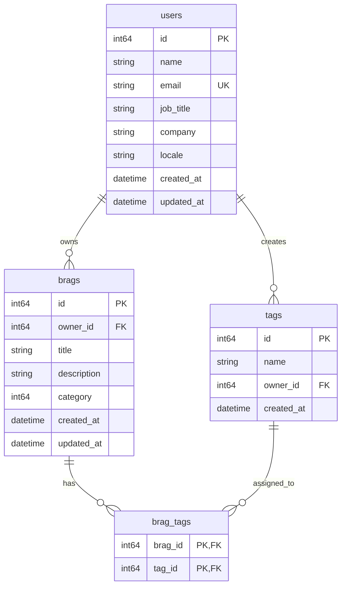
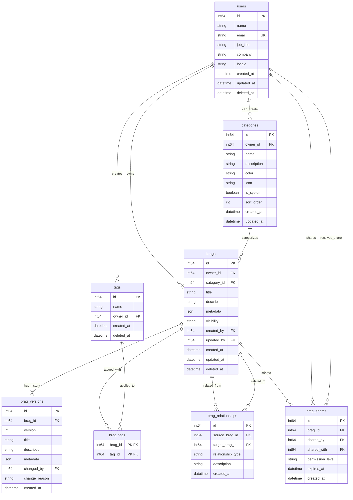
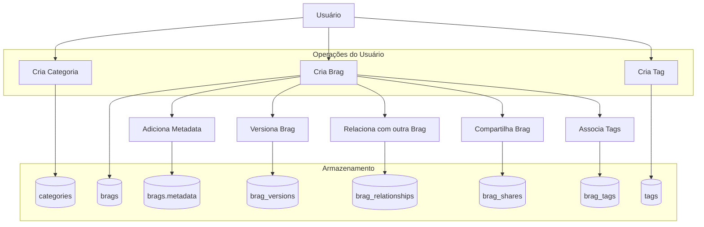
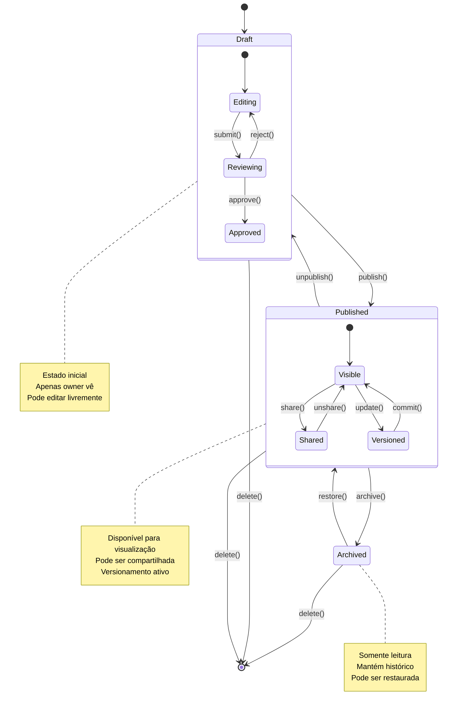

# Bragdoc - Diagrama ER Visual

## 1. Modelo Atual (beta_version)

### Diagrama Mermaid


### Representação Gráfica
```
┌─────────┐     1:N     ┌─────────┐     N:M     ┌─────────┐
│  USERS  │────────────▶│  BRAGS  │◀───────────▶│  TAGS   │
└─────────┘             └─────────┘             └─────────┘
     │                       │                       │
     └───────────────────────┼───────────────────────┘
                             │
                        ┌─────────┐
                        │BRAG_TAGS│
                        └─────────┘
```

### Descrição das Relações
1. **users → brags (1:N)**
   - Um usuário pode ter múltiplas brags
   - Cada brag pertence a exatamente um usuário
   - Chave estrangeira: `brags.owner_id → users.id`

2. **users → tags (1:N)**
   - Um usuário pode criar múltiplas tags
   - Cada tag pertence a exatamente um usuário
   - Chave estrangeira: `tags.owner_id → users.id`
   - Unique constraint: `(name, owner_id)`

3. **brags ↔ tags (N:M via brag_tags)**
   - Uma brag pode ter múltiplas tags
   - Uma tag pode ser aplicada a múltiplas brags
   - Tabela de junção: `brag_tags`
   - Chave primária composta: `(brag_id, tag_id)`
   - ON DELETE CASCADE em ambas as direções

## 2. Modelo Proposto (Aprimorado)

### Diagrama Mermaid Completo


### Representação Gráfica do Modelo Aprimorado
```
┌─────────────┐
│   USERS     │◀────────────────────────────┐
└─────────────┘                             │
       │                                     │
       ├─────────────┬─────────────┬─────────┼─────────┐
       │             │             │         │         │
┌─────────────┐┌─────────────┐┌─────────────┐┌─────────────┐
│ CATEGORIES  ││   BRAGS     ││    TAGS     ││   SHARES    │
└─────────────┘└─────────────┘└─────────────┘└─────────────┘
       ▲             │             │               │
       │             ├─────────────┤               │
       │             │             │               │
┌─────────────┐┌─────────────┐┌─────────────┐     │
│   VERSIONS  ││RELATIONSHIPS││     ...     │     │
└─────────────┘└─────────────┘└─────────────┘     │
                                                   │
                                            ┌─────────────┐
                                            │   OUTROS    │
                                            │  USUÁRIOS   │
                                            └─────────────┘
```

## 3. Comparação Detalhada

### Tabelas: Atual vs Proposto

| Tabela | Status Atual | Status Proposto | Mudanças |
|--------|-------------|-----------------|----------|
| **users** | ✅ Existente | ✅ Modificada | +deleted_at |
| **brags** | ✅ Existente | ✅ Modificada | +category_id, +metadata, +visibility, +created_by, +updated_by, +deleted_at |
| **tags** | ✅ Existente | ✅ Modificada | +deleted_at |
| **brag_tags** | ✅ Existente | ✅ Mantida | Sem mudanças |
| **categories** | ❌ Não existe | ✅ Nova | Categorias personalizáveis |
| **brag_versions** | ❌ Não existe | ✅ Nova | Histórico de alterações |
| **brag_relationships** | ❌ Não existe | ✅ Nova | Relacionamentos entre brags |
| **brag_shares** | ❌ Não existe | ✅ Nova | Sistema de permissões |

### Campos Novos por Tabela

#### **users**
```sql
-- NOVO
deleted_at DATETIME
```

#### **brags**
```sql
-- NOVOS
category_id INTEGER FOREIGN KEY categories(id)
metadata JSON
visibility TEXT
created_by INTEGER FOREIGN KEY users(id)
updated_by INTEGER FOREIGN KEY users(id)
deleted_at DATETIME
```

#### **tags**
```sql
-- NOVO
deleted_at DATETIME
```

## 4. Fluxo de Dados no Modelo Aprimorado



## 5. Índices Recomendados

### Índices Existentes (Mantidos)
```sql
CREATE INDEX idx_brag_tags_brag_id ON brag_tags(brag_id);
CREATE INDEX idx_brag_tags_tag_id ON brag_tags(tag_id);
CREATE INDEX idx_tags_owner_id ON tags(owner_id);
CREATE INDEX idx_tags_name ON tags(name);
CREATE INDEX idx_brags_owner_id ON brags(owner_id);
```

### Índices Novos (Propostos)
```sql
-- Para soft delete
CREATE INDEX idx_brags_deleted_at ON brags(deleted_at) WHERE deleted_at IS NULL;
CREATE INDEX idx_users_deleted_at ON users(deleted_at) WHERE deleted_at IS NULL;
CREATE INDEX idx_tags_deleted_at ON tags(deleted_at) WHERE deleted_at IS NULL;

-- Para categorias
CREATE INDEX idx_categories_owner_id ON categories(owner_id);
CREATE INDEX idx_categories_is_system ON categories(is_system);

-- Para versionamento
CREATE INDEX idx_brag_versions_brag_id ON brag_versions(brag_id);
CREATE INDEX idx_brag_versions_created ON brag_versions(created_at DESC);

-- Para relacionamentos
CREATE INDEX idx_brag_relationships_source ON brag_relationships(source_brag_id);
CREATE INDEX idx_brag_relationships_target ON brag_relationships(target_brag_id);

-- Para compartilhamento
CREATE INDEX idx_brag_shares_brag_id ON brag_shares(brag_id);
CREATE INDEX idx_brag_shares_shared_with ON brag_shares(shared_with);
CREATE INDEX idx_brag_shares_expires ON brag_shares(expires_at) WHERE expires_at IS NOT NULL;

-- Para busca
CREATE INDEX idx_brags_title ON brags(title);
CREATE INDEX idx_brags_created_desc ON brags(created_at DESC);
```

## 6. Considerações de Performance

### Queries Comuns Otimizadas
1. **Listar brags de um usuário (com soft delete)**
   ```sql
   SELECT * FROM brags 
   WHERE owner_id = ? AND deleted_at IS NULL 
   ORDER BY created_at DESC;
   -- Índices: idx_brags_owner_id, idx_brags_created_desc
   ```

2. **Buscar brags por categoria**
   ```sql
   SELECT * FROM brags 
   WHERE category_id = ? AND deleted_at IS NULL;
   -- Índice: idx_brags_category (existente) + idx_brags_deleted_at
   ```

3. **Listar brags compartilhadas com usuário**
   ```sql
   SELECT b.* FROM brags b
   JOIN brag_shares s ON b.id = s.brag_id
   WHERE s.shared_with = ? 
     AND (s.expires_at IS NULL OR s.expires_at > CURRENT_TIMESTAMP)
     AND b.deleted_at IS NULL;
   -- Índices: idx_brag_shares_shared_with, idx_brag_shares_expires
   ```

4. **Buscar histórico de uma brag**
   ```sql
   SELECT * FROM brag_versions 
   WHERE brag_id = ? 
   ORDER BY version DESC;
   -- Índice: idx_brag_versions_brag_id
   ```

## 7. Diagrama de Estados (Brag Lifecycle)



---

**Diagramas gerados em:** 2026-02-23  
**Formato:** Mermaid (compatível com GitHub, GitLab, docs)  
**Para visualizar:** Copie o código Mermaid para https://mermaid.live/