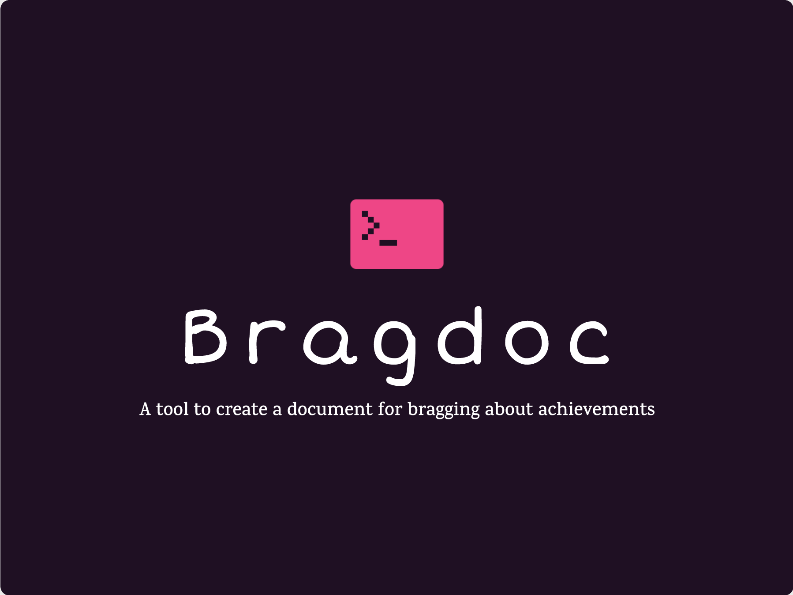

# Bragdoc



A tool to create a document for bragging about achievements.

## Motivation

### Why Bragdoc?

Bragdoc is a powerful command-line interface (CLI) tool designed to help
individuals build their own "Brag Documents." The idea behind this tool stems
from a growing recognition of the importance of self-promotion and professional
self-awareness in today's competitive job market.

Inspired by insightful articles such as:

- [Brag Documents: A Secret Weapon for Your Career](https://jvns.ca/blog/brag-documents/) by Julia Evans
- [The Brag Document: How To Successfully Showcase Your Achievements](https://eltonminetto.dev/post/2022-04-14-brag-document/) by Elton Minetto
- [Hype Yourself, You're Worth It](https://aashni.me/blog/hype-yourself-youre-worth-it/) by Aashni Shah

We recognized the need for a simple, yet powerful tool to assist individuals in
tracking and presenting their professional achievements. Bragdoc was born out
of this need, and its name, "bragdoc", encapsulates its purpose: helping you
document your accomplishments and create a powerful resource to refer to during
performance reviews.

## Features

- Create and maintain a comprehensive record of your achievements.
- Generate professional "Brag Documents" from predefined templates using AI.
- Organize your accomplishments by categories, tags, and etc.
- Easily update and edit your Brag Document as you achieve more milestones.
- Export your Brag Document to various formats (PDF, Word, Markdown) for different use cases.

## Getting Started

Ready to start documenting your achievements? Check out our comprehensive guides:

- **[Getting Started Guide](GETTING_STARTED.md)** - Complete walkthrough for new users
- **[Contributing Guide](CONTRIBUTING.md)** - Learn how to contribute to the project

### Quick Start

1. **Build from source**:
   ```bash
   git clone https://github.com/vagnerclementino/bragdoc.git
   cd bragdoc
   make build
   ```

2. **Initialize**:
   ```bash
   ./bragdoc init --name "Your Name" --email "your@email.com"
   ```

3. **Add your first achievement**:
   ```bash
   ./bragdoc brag add \
     --title "Your Achievement" \
     --description "What you accomplished and its impact" \
     --category achievement
   ```

For detailed instructions, see the [Getting Started Guide](GETTING_STARTED.md).

## Used Stack

Bragdoc is built using the Go (Golang) programming language. We chose Go for
its efficiency, performance, and robust concurrency support, making it an ideal
choice for a CLI tool.

## CLI Tools is for human beings

Bragdoc follows the best practices for writing CLI tools as recommended by
[CLIG](https://clig.dev/), ensuring a user-friendly experience, consistency,
and reliability.

## Architecture Decision Records (ADRs)

We maintain Architecture Decision Records (ADRs) to transparently document and
communicate significant project decisions. You can find the ADRs in the
[docs/adr](docs/adr) directory of this repository.

## Contributing

We welcome contributions from the community! Whether you want to:

- Report a bug
- Suggest a new feature
- Improve documentation
- Submit code changes

Please read our [Contributing Guide](CONTRIBUTING.md) to get started.

### Quick Links

- [Report an Issue](https://github.com/vagnerclementino/bragdoc/issues)
- [Contributing Guidelines](CONTRIBUTING.md)
- [Architecture Decision Records](docs/adr)

## License

This project is licensed under the MIT License - see the
[LICENSE.md](LICENSE.md) file for details.
