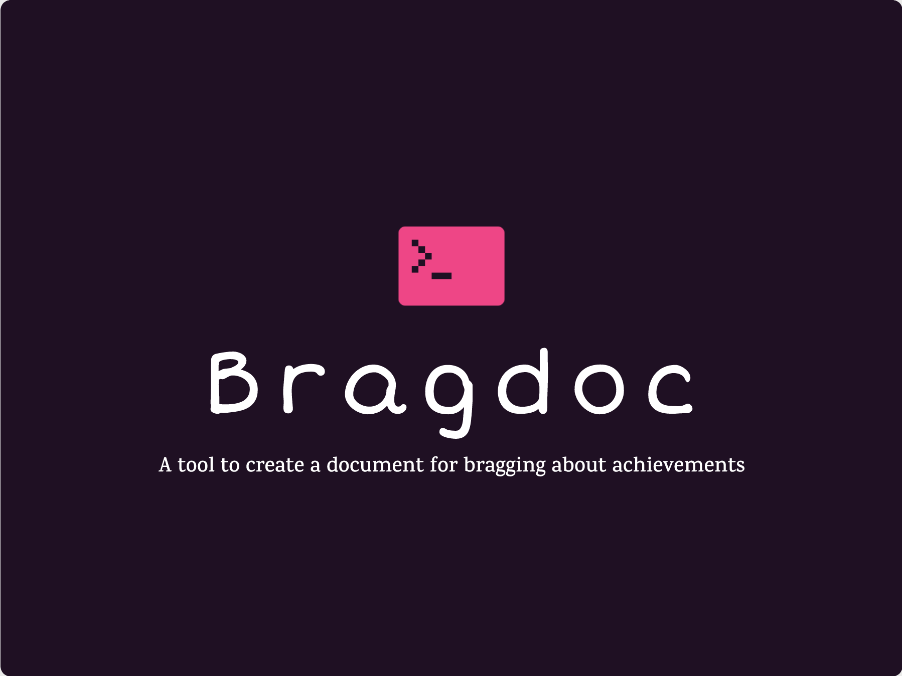

# Bragdoc



A tool to create a document for bragging about achievements.

## Motivation

### Why Bragdoc?

Bragdoc is a powerful command-line interface (CLI) tool designed to help
individuals build their own "Brag Documents." The idea behind this tool stems
from a growing recognition of the importance of self-promotion and professional
self-awareness in today's competitive job market.

Inspired by insightful articles such as:

- [Brag Documents: A Secret Weapon for Your Career](https://jvns.ca/blog/brag-documents/) by Julia Evans
- [The Brag Document: How To Successfully Showcase Your Achievements](https://eltonminetto.dev/post/2022-04-14-brag-document/) by Elton Minetto
- [Hype Yourself, You're Worth It](https://aashni.me/blog/hype-yourself-youre-worth-it/) by Aashni Shah

We recognized the need for a simple, yet powerful tool to assist individuals in
tracking and presenting their professional achievements. Bragdoc was born out
of this need, and its name, "bragdoc", encapsulates its purpose: helping you
document your accomplishments and create a powerful resource to refer to during
performance reviews.

## Features

- Create and maintain a comprehensive record of your achievements.
- Generate professional "Brag Documents" from predefined templates using AI.
- Organize your accomplishments by categories, tags, and etc.
- Easily update and edit your Brag Document as you achieve more milestones.
- Export your Brag Document to various formats (PDF, Word, Markdown) for different use cases.
- **MCP Server Mode** — expose bragdoc as an [MCP](https://modelcontextprotocol.io/) server so AI agents can manage achievements programmatically from any compatible IDE.

## Getting Started

Ready to start documenting your achievements? Check out our comprehensive guides:

- **[Getting Started Guide](GETTING_STARTED.md)** - Complete walkthrough for new users
- **[Contributing Guide](CONTRIBUTING.md)** - Learn how to contribute to the project
- **[Makefile Guide](docs/MAKEFILE.md)** - Detailed guide for all Make targets and workflows

### Prerequisites

Before building, make sure you have the following installed:

| Requirement | Version | Notes |
|---|---|---|
| [Go](https://go.dev/dl/) | 1.24+ | Required |
| C compiler | any | Required by `go-sqlite3` (CGO) |

A C compiler is **required** because the project uses [`go-sqlite3`](https://github.com/mattn/go-sqlite3), a CGO-based package. Install it for your OS:

| OS | Command |
|---|---|
| **macOS** | `xcode-select --install` |
| **Ubuntu / Debian** | `sudo apt-get install build-essential` |
| **Fedora / RHEL** | `sudo dnf install gcc` |
| **Windows (WSL2)** | Follow the Ubuntu instructions inside WSL2 — `go env GOOS` returns `linux` automatically |
| **Windows (native)** | Install [TDM-GCC](https://jmeubank.github.io/tdm-gcc/) or [WinLibs](https://winlibs.com/) and ensure `gcc` is in `PATH` |

> The build system detects the target OS and architecture automatically via `go env GOOS` / `go env GOARCH` — no manual configuration needed.
> `sqlc` is also managed automatically as a Go tool dependency — no separate installation needed.

For detailed, OS-specific instructions see the [Getting Started Guide](GETTING_STARTED.md#prerequisites).

### Quick Start

1. **Build from source**:
   ```bash
   git clone https://github.com/vagnerclementino/bragdoc.git
   cd bragdoc
   make build
   ```

2. **Initialize**:
   ```bash
   ./bragdoc init --name "Your Name" --email "your@email.com"
   ```

3. **Add your first achievement**:
   ```bash
   ./bragdoc brag add \
     --title "Your Achievement" \
     --description "What you accomplished and its impact" \
     --category achievement
   ```

For detailed instructions, see the [Getting Started Guide](GETTING_STARTED.md).

## MCP Server Mode

Bragdoc can run as an [MCP (Model Context Protocol)](https://modelcontextprotocol.io/) server, allowing AI agents in compatible IDEs to manage your achievements through natural language.

### Building the MCP Server

```bash
make build-mcp
```

This produces a `bragdoc-mcp` binary that communicates over stdio using JSON-RPC 2.0.

### Configuring in Your IDE

Add the following to your IDE's MCP configuration:

**Kiro** (`.kiro/settings/mcp.json`):
```json
{
  "mcpServers": {
    "bragdoc": {
      "command": "/path/to/bragdoc-mcp",
      "args": []
    }
  }
}
```

**VS Code / Cursor** (`.vscode/mcp.json` or equivalent):
```json
{
  "mcpServers": {
    "bragdoc": {
      "command": "/path/to/bragdoc-mcp"
    }
  }
}
```

> **Note:** Run `bragdoc init` before using MCP mode — the server uses the same database and configuration as the CLI.

### Available Tools

| Tool | Description |
|------|-------------|
| `brag_create` | Create a new brag entry |
| `brag_get` | Retrieve a brag by ID |
| `brag_list` | List all brags for a user |
| `brag_search_by_tags` | Search brags by tag names |
| `brag_search_by_category` | Search brags by category |
| `brag_update` | Update an existing brag |
| `brag_delete` | Delete a brag by ID |
| `tag_create` | Create a new tag |
| `tag_list` | List all tags for a user |
| `tag_attach` | Attach tags to a brag |
| `tag_detach` | Detach tags from a brag |
| `tag_delete` | Delete a tag |
| `tag_get_or_create` | Get or create a tag by name |
| `doc_generate` | Generate a brag document |
| `user_get` | Get user profile by ID |
| `user_list` | List all users |
| `user_get_by_email` | Get user by email |

## Development

### Available Make Targets

Run `make help` to see all available targets organized by category:

```bash
make help
```

For detailed information about all Make targets, workflows, and best practices, see the [Makefile Guide](docs/MAKEFILE.md).

#### Application Targets
- `make build` - Build the application binary
- `make build-mcp` - Build the MCP server binary (`bragdoc-mcp`)
- `make run` - Build and run the application
- `make clean` - Clean binary and artifacts
- `make install` - Install to /usr/local/bin (requires sudo)
- `make package` - Create distribution packages (zip, tar.gz)
- `make release VERSION=v1.0.0` - Create and push a new release tag

#### Quality Targets
- `make test` - Run tests with coverage
- `make test-race` - Validate race conditions
- `make lint` - Check coding style
- `make fmt` - Format code with go fmt
- `make vet` - Run go vet
- `make imports` - Organize imports with goimports
- `make quality` - Run all quality checks
- `make smoke` - Run smoke tests

#### Helper Targets
- `make generate` - Generate SQLC code
- `make tidy` - Clean up go.mod
- `make update-golden` - Update golden test files

### CI/CD Pipelines

The project uses GitHub Actions for continuous integration:

- **Quality Pipeline** - Runs on every push/PR to main
  - Go 1.25
  - Linting with golangci-lint
  - Tests with coverage
  - Coverage upload to Codecov

- **Docs Pipeline** - Runs on PRs that change commands
  - Automatically generates CLI documentation
  - Updates `docs/commands/` with latest help text
  - Commits changes back to PR branch

- **Release Pipeline** - Runs on git tags
  - Builds for 3 platforms:
    - macOS Intel (darwin/amd64)
    - macOS ARM (darwin/arm64)
    - Linux (linux/amd64)
  - Automatic GitHub Release creation
  - Binary uploads with version info

## Used Stack

Bragdoc is built using the Go (Golang) programming language. We chose Go for
its efficiency, performance, and robust concurrency support, making it an ideal
choice for a CLI tool.

## CLI Tools is for human beings

Bragdoc follows the best practices for writing CLI tools as recommended by
[CLIG](https://clig.dev/), ensuring a user-friendly experience, consistency,
and reliability.

## Architecture Decision Records (ADRs)

We maintain Architecture Decision Records (ADRs) to transparently document and
communicate significant project decisions. You can find the ADRs in the
[docs/adr](docs/adr) directory of this repository.

## Contributing

We welcome contributions from the community! Whether you want to:

- Report a bug
- Suggest a new feature
- Improve documentation
- Submit code changes

Please read our [Contributing Guide](CONTRIBUTING.md) to get started.

### Quick Links

- [Report an Issue](https://github.com/vagnerclementino/bragdoc/issues)
- [Contributing Guidelines](CONTRIBUTING.md)
- [Architecture Decision Records](docs/adr)

## License

This project is licensed under the MIT License - see the
[LICENSE.md](LICENSE.md) file for details.
