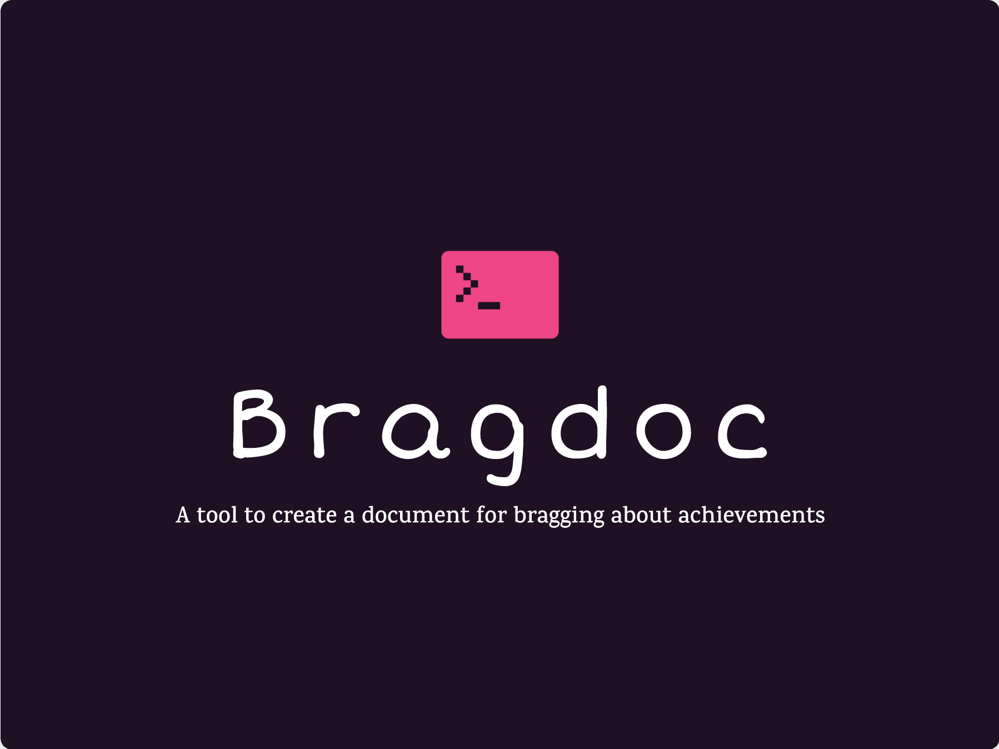

# Bragdoc

A tool to create a document for bragging about achievements.

## Motivation

### Why Bragdoc?

Bragdoc is a powerful command-line interface (CLI) tool designed to help
individuals build their own "Brag Documents." The idea behind this tool stems
from a growing recognition of the importance of self-promotion and professional
self-awareness in today's competitive job market.

Inspired by insightful articles such as:

- [Brag Documents: A Secret Weapon for Your Career](https://jvns.ca/blog/brag-documents/) by Julia Evans
- [The Brag Document: How To Successfully Showcase Your Achievements](https://eltonminetto.dev/post/2022-04-14-brag-document/) by Elton Minetto
- [Hype Yourself, You're Worth It](https://aashni.me/blog/hype-yourself-youre-worth-it/) by Aashni Shah

We recognized the need for a simple, yet powerful tool to assist individuals in
tracking and presenting their professional achievements. Bragdoc was born out
of this need, and its name, "bragdoc", encapsulates its purpose: helping you
document your accomplishments and create a powerful resource to refer to during
performance reviews.

## Features

- Create and maintain a comprehensive record of your achievements.
- Generate professional "Brag Documents" from predefined templates using AI.
- Organize your accomplishments by categories, tags, and etc.
- Easily update and edit your Brag Document as you achieve more milestones.
- Export your Brag Document to various formats (PDF, Word, Markdown) for different use cases.

## Getting Started

To get started with Bragdoc, follow these simple steps:

1. **Installation**: Install Bragdoc by running for this repository.

2. **Usage**: Use the `bragdoc` command to interact with the tool and start documenting your achievements.

3. **Templates**: Explore the available templates and customize them to match your style and preferences.

4. **Export**: Generate your Brag Document and share it with confidence during performance reviews.

## Used Stack

Bragdoc is built using the Go (Golang) programming language. We chose Go for
its efficiency, performance, and robust concurrency support, making it an ideal
choice for a CLI tool.

## CLI Tools is for human beings

Bragdoc follows the best practices for writing CLI tools as recommended by
[CLIG](https://clig.dev/), ensuring a user-friendly experience, consistency,
and reliability.

## Architecture Decision Records (ADRs)

We maintain Architecture Decision Records (ADRs) to transparently document and
communicate significant project decisions. You can find the ADRs in the
[docs/adr](docs/adr) directory of this repository.

## Contribution

We welcome contributions from the community! If you have ideas, bug reports, or
feature requests, please [open an issue](https://github.com/vagnerclementino/bragdoc/issues)
or submit a pull request.

## License

This project is licensed under the MIT License - see the
[LICENSE.md](LICENSE.md) file for details.
